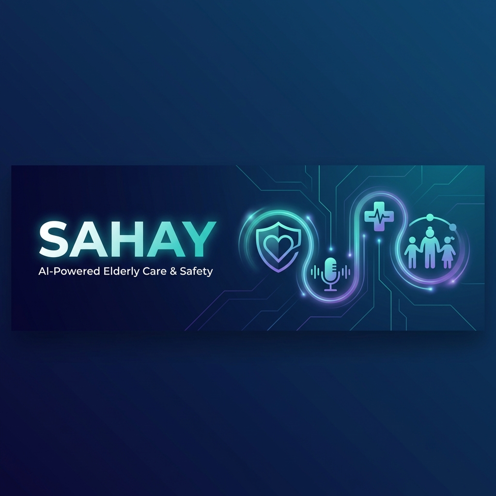

# SAHAY – AI-Powered Android Launcher for Elderly Safety & Independence



> **SAHAY** is an AI-powered Android launcher designed specifically for elderly users to make smartphones **simple, safe, and stress-free**. It provides a **big-button interface, voice-first interaction, and passive emergency monitoring** to improve independence, safety, and emotional well-being.

---

## 🌟 Problem Statement

Modern smartphone interfaces are:

- Too complex
- Full of small buttons
- Hard to navigate
- Difficult for elders with weak eyesight, arthritis, or low tech literacy

This results in:

- Dependence on others
- Reduced confidence
- Isolation
- Anxiety
- Safety risks

---

## 🚀 Solution – What is SAHAY?

**SAHAY** replaces the default Android launcher with a **simple, high-contrast, voice-controlled interface** specially designed for senior citizens.

### Core Pillars

- 🧠 **Simplicity** – Large buttons, minimal choices
- 🎤 **Voice Autonomy** – AI assistant to perform tasks
- 🚨 **Passive Safety** – Smart inactivity monitoring + SOS system
- ❤️ **Emotional Well-being** – Easy family communication & memories

---

## 📱 Key Features

### 1. Big Button Home Screen

- Huge, high-contrast buttons
- One-tap access to essential functions

**Main Actions:**

- 📞 Call Family
- 📸 Memories
- 🍔 Food & Cabs
- 🚑 Help (SOS)
- 🎤 Genie (Voice Assistant)

---

### 2. Genie – Voice AI Companion

Users can simply speak instead of typing.

**Examples:**

- "Call my grandson"
- "I want to eat pasta"
- "Book me a cab to hospital"

**Flow:**

Speech → AI Understanding → Intent Detection → Action Execution

---

### 3. Guardian Angel – Passive Safety System

Monitors inactivity using:

- Motion sensors
- Screen unlock events
- App interaction

**Logic:**

If no activity for **6 hours** →

- Voice prompt: *"Grandpa, are you okay?"*
- Wait 60 seconds
- If no response → Send **SOS alert + live location** to family

---

### 4. Emergency SOS

- Dedicated emergency screen
- Big SOS button
- 45-second countdown
- Automatic call + SMS + WhatsApp alert

---

## 🛠 Tech Stack

### Frontend (Android)

- Kotlin
- Android Studio
- Jetpack Compose
- MVVM Architecture

### Backend (Design)

- FastAPI / Node.js
- Secure APIs
- AI intent routing

### AI & Services

- Google Gemini API / OpenAI Whisper
- Twilio (SMS & Calls)
- WhatsApp Business API
- Google Maps API (Location)

---

## 🏗 System Architecture

```
User Voice
    ↓
Speech-to-Text
    ↓
AI Intent Engine
    ↓
Action Router
    ↓
Mobile Services → Call | Food | Cab | SOS
```

---

## 🔐 Security & Privacy

- No permanent voice data storage
- No continuous location tracking
- Runtime permission handling
- Encrypted API communication
- No hardcoded API keys

---

## 📂 Project Structure

```
SAHAY/
 ├── app/
 │    ├── ui/              # Jetpack Compose UI
 │    ├── viewmodel/       # MVVM logic
 │    ├── services/        # Background + SOS services
 │    ├── voice/           # Voice processing
 │    ├── emergency/       # SOS handling
 │    └── utils/
 ├── backend/              # API design (optional)
 └── README.md
```

---

## 🧪 How to Run

1. Clone the repository
2. Open in **Android Studio**
3. Sync Gradle
4. Run on real Android device (recommended for sensors & voice)

---

## 🎯 Hackathon Alignment

### Human Connection

- One-tap family calls
- Memories gallery

### Communication

- Voice-first interface

### Emotional Well-being

- Independence in daily tasks
- Reduced anxiety
- Safety assurance

---

## 🏆 Why SAHAY is Different

- Built as **Android Launcher** not just an app
- Passive emergency monitoring
- AI-based intent understanding
- Elder-first UX design
- High social impact

---

## 📸 UI Preview

> Add UI mockups/screenshots here

---

## 🤝 Team

- **Project Name:** SAHAY
- **Theme:** Bridging the Digital Divide

---

## 📜 License

This project is licensed under the **MIT License**.

---

## ❤️ Final Note

**SAHAY** is built to give elders:

> **Freedom. Safety. Confidence. Dignity.**

---

# End of README
